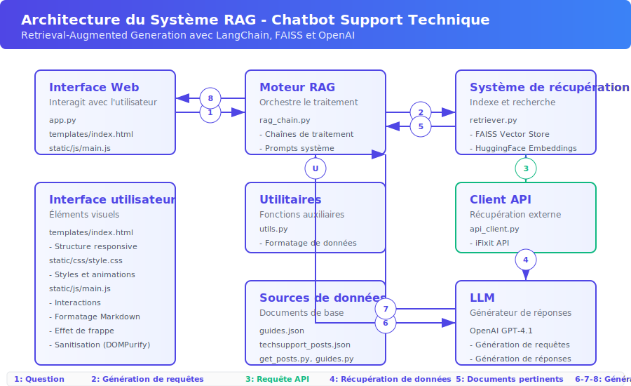

# Documentation Technique du Chatbot RAG

## Table des matières

1. [Vue d'ensemble](#vue-densemble)
2. [Architecture du système](#architecture-du-système)
3. [Modules et composants](#modules-et-composants)
   - [app.py](#apppy)
   - [rag_chain.py](#rag_chainpy)
   - [retriever.py](#retrieverpy)
   - [api_client.py](#api_clientpy)
   - [utils.py](#utilspy)
   - [templates/index.html](#templatesindexhtml)
   - [static/css/style.css](#staticcssstylecss)
   - [static/js/main.js](#staticjsmainjs)
4. [Scripts de collecte de données](#scripts-de-collecte-de-données)
   - [get_posts.py](#get_postspy)
   - [guides.py](#guidespy)
5. [Flux de données](#flux-de-données)
6. [Modèles et embeddings](#modèles-et-embeddings)
7. [Interface utilisateur](#interface-utilisateur)
8. [Configuration et déploiement](#configuration-et-déploiement)
9. [Points d'extension](#points-dextension)

## Vue d'ensemble

Ce chatbot est un système de question-réponse basé sur l'architecture RAG (Retrieval-Augmented Generation). Il utilise une combinaison de guides techniques et de discussions Reddit pour fournir des réponses détaillées et contextuelles aux questions des utilisateurs concernant le support technique.

Le système exploite LangChain pour orchestrer le flux de traitement, FAISS pour l'indexation vectorielle, Hugging Face pour les embeddings, et OpenAI GPT-4.1 pour la génération de réponses. L'application est servie via Flask et offre une API REST pour interagir avec le système, avec une interface utilisateur moderne en HTML/CSS.

## Architecture du système

Le système est composé de plusieurs modules interconnectés:

1. **Interface web** (`app.py` + templates/static): Fournit une interface utilisateur et expose une API REST.
2. **Moteur RAG** (`rag_chain.py`): Orchestre les requêtes, la récupération et la génération.  
3. **Système de récupération** (`retriever.py`): Gère l'indexation et la recherche dans la base de connaissances.
4. **Client API** (`api_client.py`): Récupère des données externes (étapes de guides iFixit).
5. **Utilitaires** (`utils.py`): Fonctions d'aide pour le formattage et la manipulation des données.
6. **Interface frontend** (`templates/index.html` + `static/css/style.css`): Présentation visuelle et interactions utilisateur.



## Modules et composants

### app.py

Ce module principal initialise l'application Flask et expose les endpoints REST pour interagir avec le chatbot.

#### Points d'entrée API:

##### GET /
```python
@app.route("/")
def index():
    return render_template("index.html")
```
Sert la page d'accueil du chatbot.

##### POST /api/chat
```python
@app.route("/api/chat", methods=["POST"])
def chat():
    start_time = time.time()
    data = request.json
    question = data.get("message", "")

    if not question:
        return jsonify({"error": "Message vide"}), 400

    # Récupération des chaînes de traitement
    rag_chain = get_rag_chain()
    generate_queries = get_generate_queries()
    retrieval_chain = get_retrieval_chain()

    # Génération des requêtes alternatives
    queries = generate_queries.invoke(question)
    
    # Récupération des documents
    retrieved_docs = retrieval_chain.invoke(question)
    formatted_docs = format_documents(retrieved_docs)
    
    # Génération de la réponse
    response = rag_chain.invoke(question)

    elapsed_time = time.time() - start_time

    return jsonify({
        "response": response,
        "queries": queries,
        "documents": formatted_docs,
        "processing_time": f"{elapsed_time:.2f} secondes",
    })
```
Endpoint principal pour le traitement des questions utilisateur:
- Accepte une question au format JSON
- Génère des requêtes alternatives pour améliorer la récupération
- Récupère les documents pertinents
- Génère une réponse détaillée avec le LLM
- Renvoie la réponse, les requêtes générées, les documents utilisés et le temps de traitement

#### Initialisation:

```python
if __name__ == "__main__":
    # Ne pas initialiser deux fois avec le reloader
    if os.environ.get("WERKZEUG_RUN_MAIN") == "true":
        with app.app_context():
            initialize_rag_system()

    # Vérifier si CUDA est disponible
    device = "cuda" if torch.cuda.is_available() else "cpu"
    logger.info(f"Utilisation du périphérique: {device}")

    app.run(debug=True, host="0.0.0.0", port=5000)
```
Initialise le système RAG et démarre le serveur Flask.

### rag_chain.py

Ce module contient la logique principale du système RAG, configurant les chaînes de traitement LangChain pour orchestrer la récupération et la génération.

#### Fonctions principales:

##### initialize_rag_system()
```python
def initialize_rag_system():
    """Initialise le système RAG avec les chaînes de traitement"""
    global _retriever, _rag_chain, _generate_queries, _retrieval_chain

    # Charger les variables d'environnement
    load_dotenv()
    OPENAI_KEY = os.getenv("OPENAI_KEY")

    # Charger les données
    posts = load_posts("./data/techsupport_posts.json")
    guides = load_guides("./data/guides.json")

    # Créer le retriever
    _retriever = index_data_embeddings(posts, guides)

    # Initialiser le LLM
    llm = ChatOpenAI(openai_api_key=OPENAI_KEY, model="gpt-4.1", temperature=0.5)

    # [Configuration des chaînes]
    
    # Chaîne de génération de requêtes
    _generate_queries = (
        prompt_template | llm | StrOutputParser() | (lambda x: x.split("\n"))
    )

    # Chaîne de récupération
    _retrieval_chain = _generate_queries | _retriever.map() | get_unique_union

    # Chaîne RAG complète
    _rag_chain = (
        {
            "context": _retrieval_chain,
            "question": RunnablePassthrough(),
        }
        | final_prompt_template
        | llm
        | StrOutputParser()
    )
```
Cette fonction essentielle initialise tout le système RAG:
- Charge les données d'entrée (posts Reddit et guides)
- Configure le retriever avec les embeddings
- Définit les prompts pour le LLM
- Configure les chaînes de traitement pour la génération de requêtes alternatives
- Configure la chaîne RAG principale

#### Prompts système:

Le système utilise deux prompts principaux:

1. **Prompt de génération de requêtes alternatives**:
```
Ta tâche est de générer cinq reformulations différentes de la question posée par l'utilisateur afin de retrouver des documents pertinents dans une base de données vectorielle.

En proposant plusieurs perspectives sur la question, ton objectif est d'aider l'utilisateur à surmonter certaines limites de la recherche par similarité basée sur la distance.

Fournis ces questions alternatives, chacune séparée par un saut de ligne.

Répond en Anglais

Question initiale : {question}
```

2. **Prompt principal RAG** (version condensée):
```
L'utilisateur pose la question suivante :

➡️ {question}

Tu disposes ci-dessous de guides techniques et de posts Reddit pertinents. [...]

🎯 Ta mission :
- Analyse et synthétise les informations [...]
- Fournis une réponse structurée et complète. [...]

📚 Sources disponibles :
{context}

🛠 Format de réponse attendu :
---
🔍 Analyse du problème : [...]
✅ Vérifications préalables recommandées : [...]
📝 Procédure détaillée proposée : [...]
💡 Conseils supplémentaires ou précautions à prendre : [...]
🔗 Sources consultées : [...]
---
```

### retriever.py

Ce module gère le chargement des données, leur préparation et l'indexation pour la recherche vectorielle.

#### Fonctions principales:

##### load_guides() et load_posts()
```python
def load_guides(file_path):
    """Charge les guides depuis un fichier JSON"""
    try:
        with open(file_path, "r", encoding="utf-8") as f:
            guides = json.load(f)
        logger.info(f"Guides chargés avec succès: {len(guides)} guides trouvés")
        return guides
    except Exception as e:
        logger.error(f"Erreur lors du chargement des guides: {e}")
        return []

def load_posts(file_path):
    """Charge les posts depuis un fichier JSON"""
    try:
        with open(file_path, "r", encoding="utf-8") as f:
            posts = json.load(f)
        logger.info(f"Posts chargés avec succès: {len(posts)} posts trouvés")
        return posts
    except Exception as e:
        logger.error(f"Erreur lors du chargement des posts: {e}")
        return []
```
Ces fonctions chargent les données sources (guides et posts Reddit) depuis les fichiers JSON.

##### index_data_embeddings()
```python
def index_data_embeddings(posts, guides, model_name="sentence-transformers/all-MiniLM-L6-v2"):
    """Convertit les posts et guides en vecteurs et crée un retriever LangChain"""
    
    # Construire les objets Document pour les posts et guides
    documents = []
    # [Code de création des documents]
    
    # Découper les documents en chunks
    text_splitter = RecursiveCharacterTextSplitter(chunk_size=1000, chunk_overlap=200)
    splits = text_splitter.split_documents(documents)
    
    # Créer des embeddings avec LangChain
    embedding_model = HuggingFaceEmbeddings(
        model_name=model_name,
    )
    vector_store = FAISS.from_documents(splits, embedding_model)
    
    # Retourner le retriever configuré
    return vector_store.as_retriever(
        search_type="similarity_score_threshold",
        search_kwargs={"k": 2, "score_threshold": 0.3},
    )
```
Cette fonction cruciale:
- Transforme les données brutes en documents LangChain
- Découpe les documents en chunks pour une meilleure recherche
- Crée les embeddings avec le modèle Hugging Face spécifié
- Indexe les embeddings dans une base FAISS
- Configure et retourne un retriever optimisé

### api_client.py

Ce module gère les interactions avec l'API externe iFixit pour récupérer les étapes détaillées des guides.

#### Fonction principale:

##### get_guide_steps()
```python
def get_guide_steps(guideid):
    """Récupère les étapes d'un guide depuis l'API iFixit"""
    url = f"https://www.ifixit.com/api/2.0/guides/{guideid}"

    try:
        response = requests.get(url)
        if response.status_code != 200:
            logger.warning(f"Échec de récupération du guide {guideid}, code: {response.status_code}")
            return {"error": f"Échec de récupération du guide {guideid}, code: {response.status_code}"}

        data = response.json()
        steps = []
        cpt_steps = 0

        for step in data.get("steps", []):
            cpt_steps += 1
            step_texts = [
                line["text_rendered"]
                for line in step.get("lines", [])
                if "text_rendered" in line
            ]
            steps.append({"stepno": cpt_steps, "text": step_texts})

        logger.info(f"Guide {guideid} récupéré avec succès: {len(steps)} étapes")
        return steps

    except Exception as e:
        logger.error(f"Erreur lors de la récupération du guide {guideid}: {e}")
        return []
```
Cette fonction:
- Récupère les étapes détaillées d'un guide depuis l'API iFixit en utilisant son ID
- Extrait et structure les données textuelles des étapes
- Gère les erreurs et les cas exceptionnels

### utils.py

Ce module fournit diverses fonctions utilitaires pour le traitement et le formattage des données.

#### Fonctions principales:

##### format_documents()
```python
def format_documents(docs):
    """Formate les documents pour l'affichage"""
    from api_client import get_guide_steps

    formatted_docs = []
    for doc in docs:
        guide_id = doc.metadata.get("guideid")
        if guide_id:
            guide_steps = get_guide_steps(guide_id)
            guide_infos = ""
            for guide in guide_steps:
                step_text = "\n".join(guide["text"])
                guide_infos += "\n" + f"Step {guide['stepno']}:\n" + step_text

            if guide_infos not in doc.page_content:
                doc.page_content += guide_infos

        metadata_text = "\n".join(f"{key}: {value}" for key, value in doc.metadata.items())
        formatted_doc = f"""---\n📄 Contenu :\n{doc.page_content}\n\n🔖 Métadonnées :\n{metadata_text}\n"""
        formatted_docs.append(formatted_doc)

    return "\n\n".join(formatted_docs)
```
Cette fonction:
- Enrichit les documents guides avec leurs étapes détaillées (requêtes API)
- Formate les documents pour l'affichage avec séparation contenu/métadonnées
- Prépare les documents pour être utilisés dans le contexte du LLM

##### get_unique_union()
```python
def get_unique_union(documents: list[list[Document]]) -> list[Document]:
    """Renvoie une liste de documents uniques à partir d'une liste de listes de documents."""
    # Aplatir la liste
    flattened_docs = [
        dumps(doc.__dict__, sort_keys=True) for sublist in documents for doc in sublist
    ]

    # Supprimer les doublons
    unique_docs = list(set(flattened_docs))

    # Reconvertir en objets Document
    return [Document(**loads(doc)) for doc in unique_docs]
```
Cette fonction:
- Prend plusieurs listes de documents (résultats de plusieurs requêtes)
- Élimine les doublons pour éviter la redondance
- Retourne une liste unifiée de documents uniques

### templates/index.html

Ce fichier définit l'interface utilisateur principale de l'application, présentant un design moderne et réactif.

#### Structure principale:

```html
<!DOCTYPE html>
<html lang="fr">
  <head>
    <!-- Métadonnées et liens vers CSS/JS externes -->
  </head>
  <body class="bg-gradient-to-br from-gray-50 to-gray-100 font-sans">
    <div class="container mx-auto px-4 py-6 max-w-6xl">
      <!-- En-tête avec titre et contrôles -->
      <header>...</header>

      <!-- Zone de chat -->
      <div class="bg-white shadow-lg rounded-2xl overflow-hidden border border-gray-100 chat-container">
        <!-- En-tête du chat -->
        <div class="bg-gradient-to-r from-indigo-600 to-blue-500 px-6 py-4 text-white">...</div>

        <!-- Messages -->
        <div id="chat-messages" class="chat-messages p-4 bg-gray-50">
          <!-- Message de bienvenue -->
          <div class="message message-bot">...</div>
        </div>

        <!-- Zone de saisie -->
        <div class="p-4 border-t border-gray-100">
          <div class="flex items-center bg-gray-50 rounded-xl p-1 border border-gray-200">
            <input id="user-input" type="text" class="flex-grow bg-transparent border-none focus:outline-none px-4 py-3 text-gray-700" placeholder="Posez votre question technique ici..." />
            <button id="send-button" class="bg-gradient-to-r from-indigo-600 to-blue-500 hover:from-indigo-700 hover:to-blue-600 text-white rounded-lg p-3 transition-all shadow-md">
              <i class="fas fa-paper-plane"></i>
            </button>
          </div>
        </div>
      </div>

      <!-- Pied de page -->
      <footer>...</footer>
    </div>

    <!-- Script principal -->
    <script src="/static/js/main.js"></script>
  </body>
</html>
```

#### Caractéristiques principales:

1. **Structure responsive** - Utilise Tailwind CSS pour une mise en page adaptative
2. **Interface moderne** - Design avec dégradés, ombres et arrondis
3. **Visualisation des données RAG** - Panneaux pliables pour:
   - Requêtes alternatives générées
   - Documents récupérés avec leurs métadonnées
4. **Suivi des performances** - Affichage du temps de traitement
5. **Support pour Markdown** - Utilise marked.js pour le rendu du contenu formaté
6. **Sécurité intégrée** - DOMPurify pour la sanitisation du contenu

### static/css/style.css

Ce fichier contient les styles personnalisés pour l'application, complémentant Tailwind CSS avec des animations et des styles spécifiques.

#### Catégories de styles:

1. **Styles de base**:
```css
body {
    font-family: 'Poppins', sans-serif;
    color: #333;
    line-height: 1.6;
}
```

2. **Animations**:
```css
/* Animation de chargement */
.loading-dots:after {
    content: '';
    animation: dots 1.5s steps(5, end) infinite;
}

@keyframes dots {
    0%, 20% { content: '.'; }
    40% { content: '..'; }
    60% { content: '...'; }
    80%, 100% { content: ''; }
}

/* Animation de pulsation */
.pulse-animation {
    animation: pulse 2s infinite;
}

@keyframes pulse {
    0% { box-shadow: 0 0 0 0 rgba(72, 187, 120, 0.7); }
    70% { box-shadow: 0 0 0 10px rgba(72, 187, 120, 0); }
    100% { box-shadow: 0 0 0 0 rgba(72, 187, 120, 0); }
}
```

3. **Mise en page du chat**:
```css
.chat-container {
    height: calc(100vh - 230px);
    display: flex;
    flex-direction: column;
}

.chat-messages {
    flex: 1;
    overflow-y: auto;
    scrollbar-width: thin;
    scrollbar-color: rgba(79, 70, 229, 0.2) transparent;
    position: relative;
}
```

4. **Styles des messages**:
```css
.message {
    max-width: 85%;
    margin-bottom: 20px;
    display: flex;
    position: relative;
    animation: fadeIn 0.3s ease-out;
}

.message-bot .message-avatar {
    background: linear-gradient(45deg, #4f46e5, #3b82f6);
    color: white;
    box-shadow: 0 4px 6px rgba(79, 70, 229, 0.15);
}

.message-user .message-avatar {
    background: linear-gradient(45deg, #10b981, #059669);
    color: white;
    box-shadow: 0 4px 6px rgba(16, 185, 129, 0.15);
}
```

5. **Rendu du Markdown**:
```css
.markdown-body h1 {
    font-size: 1.75rem;
    font-weight: 600;
    margin-top: 1.5rem;
    margin-bottom: 0.75rem;
    color: #1e293b;
}

.markdown-body code {
    font-family: 'Menlo', 'Monaco', 'Courier New', monospace;
    background-color: #f1f5f9;
    padding: 0.2rem 0.4rem;
    border-radius: 0.25rem;
    font-size: 0.875rem;
    color: #4f46e5;
    border: 1px solid #e2e8f0;
}
```

6. **Styles des sections de réponse**:
```css
.problem-analysis,
.checks,
.procedure,
.tips,
.sources {
    margin: 1.25rem 0;
    padding: 1rem;
    border-radius: 0.5rem;
    box-shadow: 0 2px 4px rgba(0, 0, 0, 0.05);
    position: relative;
    padding-left: 1.25rem;
}

.problem-analysis {
    background-color: #eef2ff;
    border-left: 4px solid #4f46e5;
}
```

7. **Responsive design**:
```css
@media (max-width: 640px) {
    .message {
        max-width: 95%;
    }
}
```

### static/js/main.js

Ce module JavaScript gère l'interface utilisateur côté client, les interactions et les animations du chatbot.

#### Fonctions principales:

##### Initialisation et configuration
```javascript
document.addEventListener('DOMContentLoaded', function () {
    // Récupération des éléments DOM
    const chatMessages = document.getElementById('chat-messages')
    const userInput = document.getElementById('user-input')
    const sendButton = document.getElementById('send-button')
    // ...
})
```
Le code s'initialise au chargement complet du DOM et configure les références vers les éléments d'interface.

##### formatMarkdown()
```javascript
function formatMarkdown(text) {
    // Formatage spécial pour les sections du format de réponse attendu
    text = text.replace(/🔍\s*\*\*Analyse du problème\*\*\s*:/g, '<div class="problem-analysis"><strong>🔍 Analyse du problème :</strong>')
    // Autres remplacements...
    
    // Utiliser marked pour le reste du formatage markdown
    let formattedText = marked.parse(text)
    
    // Sanitiser le HTML pour éviter les injections XSS
    return DOMPurify.sanitize(formattedText)
}
```
Cette fonction convertit le texte markdown en HTML avec des améliorations visuelles pour les sections spécifiques des réponses du chatbot. Elle utilise la bibliothèque `marked.js` et `DOMPurify` pour la sanitisation du contenu.

##### addMessage()
```javascript
function addMessage(content, isUser = false) {
    const messageDiv = document.createElement('div')
    messageDiv.className = `message ${isUser ? 'message-user' : 'message-bot'}`
    
    // Création de l'avatar
    const avatarDiv = document.createElement('div')
    avatarDiv.className = 'message-avatar'
    // ...
    
    // Animation d'entrée
    setTimeout(() => {
        messageDiv.style.opacity = '1'
        messageDiv.style.transform = 'translateY(0)'
    }, 10)
    
    return { messageDiv, innerDiv }
}
```
Ajoute un nouveau message dans la conversation avec des styles différents selon qu'il provient de l'utilisateur ou du chatbot. Inclut des animations pour une expérience utilisateur fluide.

##### addTypingEffect()
```javascript
async function addTypingEffect(element, content) {
    // Paramètres ajustés pour un effet visuel plus naturel mais pas trop lent
    const minDelay = 10;   // Délai minimum entre les caractères (ms)
    const maxDelay = 25;   // Délai maximum entre les caractères (ms)
    
    // Mode accéléré pour les contenus longs
    const fastMode = content.length > fastModeThreshold;
    
    // Diviser le contenu en segments pour préserver le formatage markdown
    const segments = preprocessContentForTyping(content)
    // ...
}
```
Crée un effet de frappe en temps réel pour simuler une réponse progressive du chatbot. La fonction adapte intelligemment sa vitesse selon la longueur du contenu et gère les segments spéciaux du texte pour préserver le formatage.

##### preprocessContentForTyping()
```javascript
function preprocessContentForTyping(content) {
    const segments = []
    
    // Expressions régulières pour détecter les structures markdown complexes
    const patterns = [
        // Sections spéciales
        /🔍\s*\*\*Analyse du problème\*\*\s*:.+?(?=✅\s*\*\*Vérifications|📝\s*\*\*Procédure|💡\s*\*\*Conseils|🔗\s*\*\*Sources|$)/s,
        // Autres patterns...
    ]
    // ...
    return segments
}
```
Pré-traite le contenu pour l'effet de frappe en identifiant les segments spéciaux (markdown complexe, sections formatées, code) pour les afficher de manière optimisée.

##### addLoadingMessage() et removeLoadingMessage()
```javascript
function addLoadingMessage() {
    const loadingDiv = document.createElement('div')
    // ...
    innerDiv.innerHTML = `
        <div class="flex items-center space-x-2">
            <svg class="animate-spin h-4 w-4 text-indigo-600" xmlns="http://www.w3.org/2000/svg" fill="none" viewBox="0 0 24 24">
                <!-- ... -->
            </svg>
            <span class="text-indigo-700 font-medium">Analyse en cours</span>
            <span class="loading-dots text-indigo-700"></span>
        </div>
    `
    // ...
}
```
Affiche et supprime un indicateur animé de chargement pendant le traitement des requêtes.

##### displayQueries() et gestion du toggle
```javascript
function displayQueries(queries) {
    queriesList.innerHTML = ''
    
    // Ajouter les requêtes avec une légère animation
    queries.forEach((query, index) => {
        setTimeout(() => {
            // Création et animation des éléments
        }, index * 100) // Ajouter un délai pour chaque élément
    })
    
    // Animation du conteneur
    // ...
}

// Gestion du toggle pour les requêtes avec animation
toggleQueries.addEventListener('click', function () {
    // Animation d'ouverture/fermeture
})
```
Affiche les requêtes alternatives générées par le système avec des animations élégantes. Le toggle permet d'afficher/masquer cette section.

##### displayDocuments(), formatDocumentContent() et gestion du toggle
```javascript
function displayDocuments(documents) {
    // Affichage des documents récupérés avec animations
    // ...
}

function formatDocumentContent(docText) {
    // Extraction et formatage du contenu et des métadonnées
    // ...
    return `
        <div class="document-header flex items-center justify-between mb-2">
            <!-- Template du document formaté -->
        </div>
        <!-- ... -->
    `
}

// Gestion du toggle pour les documents et délégation d'événements
```
Ces fonctions gèrent l'affichage, le formatage et les interactions avec la section des documents récupérés. Inclut des fonctionnalités comme l'affichage/masquage des détails et des animations fluides.

##### sendMessage()
```javascript
async function sendMessage() {
    const message = userInput.value.trim()
    if (!message) return
    
    // Désactiver l'input pendant l'envoi
    userInput.disabled = true
    // ...
    
    try {
        // Appel API avec fetch
        const response = await fetch('/api/chat', {
            method: 'POST',
            headers: {
                'Content-Type': 'application/json'
            },
            body: JSON.stringify({ message })
        })
        
        const data = await response.json()
        
        // Traitement de la réponse
        // ...
    } catch (error) {
        // Gestion des erreurs
    } finally {
        // Réactivation de l'interface
    }
}
```
Fonction centrale qui envoie les messages utilisateur à l'API, affiche les réponses et met à jour l'interface utilisateur en conséquence. Gère l'état de l'interface pendant les communications avec le serveur.

#### Caractéristiques notables:

1. **Animations et transitions fluides**:
   - Effet de frappe pour simuler une réponse progressive
   - Animations d'entrée/sortie pour les messages et panneaux
   - Transitions pour les changements d'état

2. **Gestion intelligente du contenu**:
   - Prétraitement et segmentation du markdown complexe
   - Adaptation de la vitesse d'affichage selon la longueur du contenu
   - Formatage visuel amélioré des sections spécifiques de réponse

3. **Optimisations UX**:
   - Indicateurs de chargement animés
   - Effets visuels pour les changements d'état (temps de traitement)
   - Panneaux pliables pour les informations secondaires (requêtes, documents)

4. **Sécurité intégrée**:
   - Sanitisation du HTML avec DOMPurify
   - Validation des entrées utilisateur
   - Gestion gracieuse des erreurs API

5. **Fonctionnalités avancées**:
   - Système de visualisation des détails des documents
   - Formatage adaptatif selon le type de contenu
   - Affichage optimisé des métadonnées

## Scripts de collecte de données
### get_posts.py

Ce module est responsable de récupérer les posts et leurs commentaires depuis le subreddit "techsupport" sur Reddit à l'aide de l'API PRAW.

#### Vue d'ensemble

Le script se connecte à Reddit via l'API PRAW, récupère les posts du subreddit "techsupport", extrait jusqu'à 20 commentaires par post, et sauvegarde l'ensemble dans un fichier JSON.

#### Configuration

```python
# Connexion à l'API Reddit
reddit = praw.Reddit(
    client_id="6NAkftfhMW0UzBTsOk_WUw",
    client_secret="DGoO-wC2rWF9kuHRk8EcvQ5IIvoq2Q",
    user_agent="script:reddit.techsupport.scraper:v1.0 (par /u/Ambitious_Shopping45)",
)

# Fichier JSON pour stocker les posts avec leurs commentaires
FICHIER_JSON = "techsupport_posts.json"
```

La configuration inclut les identifiants d'API nécessaires et le chemin du fichier de sortie.

#### Fonctions principales

##### Récupération et traitement de posts

```python
# Récupérer un maximum de posts
posts_data = []

for post in subreddit.top(limit=None):  # Pas de limite de posts
    post.comments.replace_more(limit=0)  # Supprime les "More Comments"

    # Récupérer jusqu'à 20 commentaires par post
    comments = [comment.body for comment in post.comments.list()[:20]]

    post_info = {
        "id": post.id,
        "titre": post.title,
        "contenu": post.selftext,
        "url": post.url,
        "date": post.created_utc,
        "score": post.score,
        "nombre_commentaires": post.num_comments,
        "comments": comments,  # Liste des 20 premiers commentaires max
    }

    posts_data.append(post_info)
```

Cette section:
- Parcourt les posts du subreddit en ordre de popularité (pas de limite)
- Pour chaque post, extrait jusqu'à 20 commentaires
- Structure les données de post et commentaires dans un dictionnaire
- Ajoute chaque post traité à une liste

#### Sauvegarde des données

```python
# Sauvegarde en une seule fois (plus rapide)
with open(FICHIER_JSON, "w", encoding="utf-8") as f:
    json.dump(posts_data, f, indent=4, ensure_ascii=False)

print(
    f"{len(posts_data)} posts enregistrés avec un max de 20 commentaires chacun dans {FICHIER_JSON} !"
)
```

Cette section:
- Sauvegarde tous les posts collectés dans un fichier JSON
- Utilise un encodage UTF-8 pour préserver les caractères spéciaux
- Affiche un message de confirmation avec le nombre de posts récupérés

### guides.py

Ce module est responsable de récupérer les guides techniques depuis l'API publique de iFixit.

#### Vue d'ensemble

Le script se connecte à l'API iFixit, récupère tous les guides disponibles via une pagination, et sauvegarde l'ensemble dans un fichier JSON.

#### Fonctions principales

##### fetch_all_guides()

```python
def fetch_all_guides():
    all_guides = []
    offset = 0
    limit = 20
    has_more = True

    while has_more:
        url = f"https://www.ifixit.com/api/2.0/guides?offset={offset}&limit={limit}"
        response = requests.get(url)

        # Vérifiez la réponse
        print(f"Status Code: {response.status_code}")
        print(
            f"Response Content: {response.content[:200]}..."
        )  # Affiche les premiers 200 caractères de la réponse

        if response.status_code == 200:
            try:
                guides = response.json()
                all_guides.extend(guides)

                if len(guides) < limit:
                    has_more = False
                else:
                    offset += limit
            except ValueError:
                print("Erreur de décodage JSON")
                break
        elif response.status_code == 429:
            # Si la limite est atteinte, attendons 30 secondes avant de continuer
            print("Limite de requêtes atteinte. Attente de 30 secondes...")
            time.sleep(30)  # Attendre 30 secondes avant de réessayer
        else:
            print(
                f"Erreur lors de la récupération des données. Code statut: {response.status_code}"
            )
            break

    return all_guides
```

Cette fonction:
- Utilise la pagination pour récupérer tous les guides (20 par requête)
- Gère les limites de taux d'API (code 429) avec une attente automatique
- Affiche des informations de débogage sur le statut de la requête
- Accumule tous les guides dans une liste

#### Exécution principale

```python
# Récupérer tous les guides
guides = fetch_all_guides()

# Enregistrement des guides dans un fichier JSON
if guides:
    with open("./data/guides.json", "w") as f:
        json.dump(guides, f, indent=2)
    print("Données enregistrées dans guides.json")
else:
    print("Aucun guide trouvé ou problème avec l'API.")
```

Cette section:
- Appelle la fonction pour récupérer tous les guides
- Vérifie que des guides ont été trouvés
- Sauvegarde les guides dans un fichier JSON
- Affiche un message de confirmation ou d'erreur selon le résultat


## Flux de données

Le flux de données du système suit ces étapes:

1. **Saisie de la question**:
   - L'utilisateur soumet une question via l'interface ou l'API

2. **Préparation des requêtes**:
   - La question est reformulée en 5 variantes pour améliorer la récupération
   - Les variantes sont générées par le LLM via `generate_queries`

3. **Récupération**:
   - Chaque variante est utilisée pour interroger la base vectorielle
   - Les résultats sont fusionnés et dédupliqués via `get_unique_union`
   - Pour les guides, les étapes détaillées sont récupérées via l'API iFixit

4. **Génération de réponse**:
   - Les documents récupérés sont formatés et ajoutés au contexte
   - Le LLM génère une réponse structurée basée sur le contexte et la question
   - La réponse est formatée selon le template défini

5. **Retour à l'utilisateur**:
   - La réponse, les requêtes générées, les documents récupérés et le temps de traitement sont renvoyés
   - L'interface web affiche la réponse formatée en Markdown
   - Les données additionnelles (requêtes, documents) sont disponibles dans des panneaux pliables

## Modèles et embeddings

Le système utilise:

1. **Modèle d'embeddings**:
   - Hugging Face `sentence-transformers/all-MiniLM-L6-v2`
   - Utilisé pour transformer les textes en vecteurs
   - Configuré pour utiliser CUDA si disponible

2. **Modèle de langage**:
   - OpenAI GPT-4.1
   - Temperature de 0.5 (équilibre créativité/déterminisme)
   - Utilisé pour la génération de requêtes et la génération de réponses

3. **Base vectorielle**:
   - FAISS (Facebook AI Similarity Search)
   - Configuration: `similarity_score_threshold` avec k=2 et seuil=0.3
   - Optimisée pour la vitesse et la précision

## Interface utilisateur

L'interface utilisateur du système est construite avec les technologies web modernes pour offrir une expérience utilisateur optimale:

### Caractéristiques principales:

1. **Design adaptatif**:
   - Mise en page responsive qui s'adapte aux différentes tailles d'écran
   - Utilisation de Tailwind CSS pour les styles de base
   - Styles personnalisés pour les animations et composants spécifiques

2. **Organisation visuelle**:
   - Interface de chat familière avec messages utilisateur/bot différenciés
   - Barre de saisie fixe en bas pour une interaction naturelle
   - Panneaux pliables pour les informations techniques (requêtes, documents)

3. **Visualisation des données RAG**:
   - Affichage des requêtes alternatives générées
   - Présentation des documents récupérés avec métadonnées
   - Indicateur de temps de traitement pour la transparence

4. **Fonctionnalités avancées**:
   - Rendu Markdown pour les réponses structurées
   - Différenciation visuelle des sections de réponse (analyse, procédure, etc.)
   - Animations subtiles pour améliorer l'expérience (chargement, messages)

5. **Composants JavaScript**:
   - `main.js` gère les interactions utilisateur
   - `marked.js` pour le rendu Markdown
   - `DOMPurify` pour la sécurité du contenu HTML

## Configuration et déploiement

### Prérequis:

- Python 3.x
- Fichiers sources JSON (`./data/guides.json` et `./data/techsupport_posts.json`)
- Clé API OpenAI dans le fichier `.env`
- CUDA recommandé pour de meilleures performances

### Structure des fichiers:

```
.
├── api_client.py                     # Client API pour iFixit
├── app.py                            # Application Flask principale
├── rag_chain.py                      # Configuration des chaînes RAG
├── requirements.txt                  # Dépendances Python
├── retriever.py                      # Gestion de la récupération des documents
├── utils.py                          # Fonctions utilitaires
├── .env                              # Variables d'environnement (OPENAI_KEY)
├── assets/                           # Autres ressources (images, etc.)
│   ├── architecture_diagram.svg      # Schéma de l'architecture de l'application
├── data/                             # Données sources
│   ├── guides.json                   # Guides techniques
│   └── techsupport_posts.json        # Posts Reddit
├── static/                           # Ressources statiques
│   ├── css/
│   │   └── style.css                 # Styles CSS personnalisés
│   └── js/
│       └── main.js                   # Scripts JavaScript
└── templates/                        # Templates Flask
    └── index.html                    # Page d'accueil
```

### Installation:

```bash
# Activer l'environnement virtuel
.\venv\Scripts\activate 

# Installer les dépendances
pip install -r requirements.txt

# Créer le fichier .env avec la clé API
echo "OPENAI_KEY=votre_cle_api" > .env

# Lancer l'application
python app.py
```

## Points d'extension

Le système peut être étendu de plusieurs façons:

1. **Ajout de nouvelles sources**:
   - Modifier `retriever.py` pour intégrer de nouvelles sources de données
   - Adapter le format des documents dans `index_data_embeddings()`

2. **Changement de modèles**:
   - Modifier le modèle d'embeddings dans `index_data_embeddings()`
   - Modifier le modèle LLM dans `initialize_rag_system()`

3. **Optimisation des prompts**:
   - Adapter les templates dans `initialize_rag_system()`
   - Affiner le format de réponse selon les besoins

4. **Amélioration du retriever**:
   - Ajuster les paramètres du retriever (`chunk_size`, `search_kwargs`, etc.)
   - Implémenter des techniques de ré-ordonnancement ou de boosting

5. **Interface utilisateur**:
   - Modifier `templates/index.html` et `static/css/style.css` pour personnaliser l'interface
   - Ajouter des fonctionnalités comme l'historique des conversations
   - Intégrer des visualisations pour la pertinence des documents

6. **Optimisations frontend**:
   - Améliorer les animations et transitions
   - Ajouter des graphiques pour visualiser la pertinence des résultats
   - Implémenter un mode sombre/clair
   - Ajouter la sauvegarde de conversations